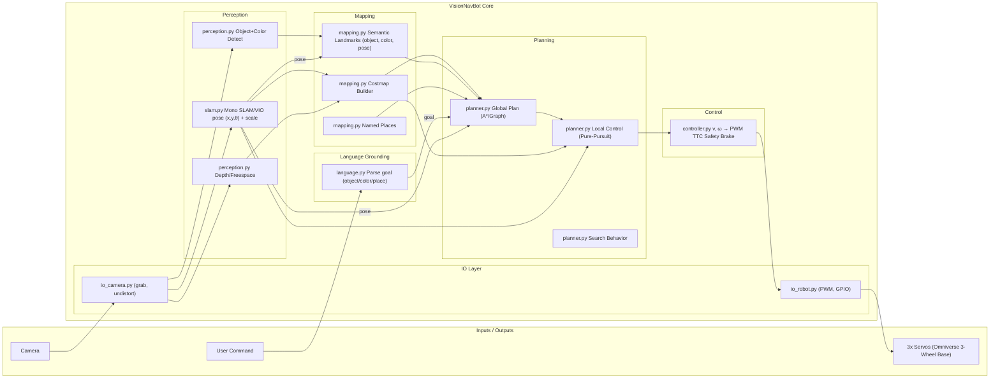

```mermaid
flowchart LR
  %% ===== System Architecture (runtime dataflow) =====
  subgraph Inputs_Outputs["Inputs / Outputs"]
    Cam["Camera"]
    User["User Command"]
    Servos["3x Servos (Omniverse 3-Wheel Base)"]
  end

  subgraph Core["VisionNavBot Core"]
    subgraph IO["IO Layer"]
      IOCam["io_camera.py (grab, undistort)"]
      IORobot["io_robot.py (PWM, GPIO)"]
    end

    subgraph Perception["Perception"]
      SLAM["slam.py Mono SLAM/VIO pose (x,y,θ) + scale"]
      DET["perception.py Object+Color Detect"]
      FREE["perception.py Depth/Freespace"]
    end

    subgraph Mapping["Mapping"]
      MAP["mapping.py Costmap Builder"]
      SEM["mapping.py Semantic Landmarks (object, color, pose)"]
      PLACES["mapping.py Named Places"]
    end

    subgraph Planning["Planning"]
      GLB["planner.py Global Plan (A*/Graph)"]
      LOC["planner.py Local Control (Pure-Pursuit)"]
      SRCH["planner.py Search Behavior"]
    end

    subgraph Control["Control"]
      CTR["controller.py v, ω → PWM TTC Safety Brake"]
    end

    subgraph Lang["Language Grounding"]
      LPARSE["language.py Parse goal (object/color/place)"]
    end
  end

  %% Edges
  Cam --> IOCam
  IOCam --> SLAM
  IOCam --> DET
  IOCam --> FREE

  SLAM --> MAP
  FREE --> MAP
  DET --> SEM
  SLAM -->|pose| SEM

  MAP --> GLB
  SEM --> GLB
  PLACES --> GLB

  User --> LPARSE
  LPARSE -->|goal| GLB
  SLAM -->|pose| GLB

  GLB --> LOC
  MAP --> LOC
  SLAM --> LOC

  LOC --> CTR
  CTR --> IORobot
  IORobot --> Servos
```
